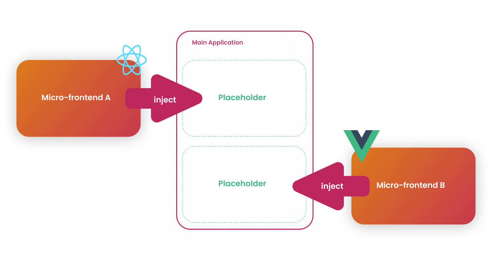

import {RaguWebsiteLoader} from "../docs-components/ragu-website/Loader";

`DRAFT`: This page is a draft page.

Ragu can inject a front-end made by any technology into any application.

It is specially useful for legacy system modernization since you don't
need to replace your entire application at once.

### Demo

Let's go thought Ragu's homepage micro-frontends and inject them independently.

<RaguWebsiteLoader />
